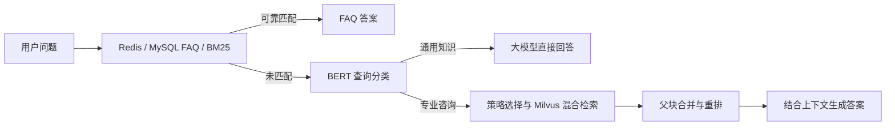

# FAQ + Milvus RAG 智能问答系统

结合 FAQ 快速匹配与检索增强生成：优先通过 Redis 缓存和 MySQL FAQ 的 BM25 检索回答；无法可靠匹配时，进入 BERT 查询分类与 RAG 流程。支持父子分块、BGE-M3 稠密/稀疏混合检索、父块合并、BGE 重排，以及直接检索、HyDE、子问题和回溯策略。



## 项目组成

- `main.py`：FAQ 与 RAG 统一入口，延迟初始化并复用 RAG。
- `mysql_qa/`：FAQ 导入、Redis 缓存、Jieba 分词与 BM25 匹配。
- `rag_qa/core/`：BERT 分类训练、策略选择、文档处理、向量存储与问答。
- `rag_qa/edu_document_loaders/`：PDF、Word、PPT、图片解析与 OCR。
- `evaluation/`：FAQ、RAG 检索与 Ragas 生成质量评估，以及脱敏后的历史结果。
- `reports/`：脱敏后的分类器训练元数据。

## 历史结果

| 评估 | 归档结果 |
| --- | --- |
| BERT 查询分类 | 验证准确率 99%，F1 约 0.9899 |
| 检索与重排 | Hit@1：83.33% → 95.83%；MRR：0.8993 → 0.9792 |
| Ragas 生成质量 | Faithfulness 0.9361；Answer Relevancy 0.8224；Answer Correctness 0.5794 |

以上来自已有评估记录，限定于相应数据和配置。本次上传未重新训练模型或调用在线评审。离线检索评估使用进程内精确检索替代 Milvus ANN，不代表线上召回率或服务延迟；Ragas 历史运行使用 OpenRouter 的 GPT 模型，与主系统 DeepSeek 配置不同。

[分类器记录](reports/classifier_training_metadata.json) · [检索报告](evaluation/rag/results/rag_report_20260825_212355.md) · [生成质量报告](evaluation/rag/results/ragas_report_20260825_223747.md)

## 安装与配置

在本项目目录使用 Python 3.10 创建独立环境：

```powershell
python -m venv .venv
.\.venv\Scripts\Activate.ps1
python -m pip install -r requirements.txt
Copy-Item config.example.ini config.ini
```

依赖版本来自已有本地环境，未重新验证全新环境安装。OCR 默认可以回退到 ONNX Runtime；Paddle OCR 属于可选路径。Ragas 的额外依赖见 `evaluation/rag/requirements-ragas.txt`。

修改本地 `config.ini` 中的 MySQL、Redis、Milvus 地址；该文件已被 Git 忽略。也可用环境变量覆盖数据库配置：`MYSQL_HOST`、`MYSQL_PORT`、`MYSQL_USER`、`MYSQL_PASSWORD`、`MYSQL_DATABASE`、`REDIS_HOST`、`REDIS_PORT`、`REDIS_PASSWORD`、`REDIS_DB`、`MILVUS_HOST`、`MILVUS_PORT`、`MILVUS_DATABASE_NAME`、`MILVUS_COLLECTION_NAME`。

DeepSeek 密钥通过 `DEEPSEEK_API_KEY` 设置。无本地配置文件时会读取无凭据的 `config.example.ini`，方便离线检查；在线运行前仍需配置数据库和密钥。

## 模型与知识库准备

本次不上传本地大型模型权重、PDF/Office/图片样例、日志、向量缓存或数据库文件。以下路径需要自行准备对应模型，代码默认从本地读取：

| 本地目录 | 用途 |
| --- | --- |
| `rag_qa/models/bert-base-chinese` | 中文 BERT 基础模型 |
| `rag_qa/models/bert_query_classifier` | 本项目训练后的查询分类器 |
| `rag_qa/models/bge-m3` | 稠密与稀疏向量 |
| `rag_qa/models/bge-reranker-large` | 重排 |
| `rag_qa/nlp_bert_document-segmentation_chinese-base` | 可选模型分段示例 |

分类数据位于 `rag_qa/classify_data/`。准备 BERT 基础模型后，调用训练入口：

```powershell
python -c "from rag_qa.core.query_classifier import main; main()" --mode train
```

先在 MySQL 创建配置指定的数据库，并授予业务账号相应权限，再导入 FAQ：

```python
from mysql_qa.db.mysql_client import MySQLClient
client = MySQLClient()
try:
    client.create_table()
    client.insert_data("mysql_qa/data/JP学科知识问答.csv")
finally:
    client.close()
```

将有权使用的知识文档放入 `rag_qa/data/ai_data/`，启动 Milvus 并准备 BGE 模型后建立索引：

```python
from rag_qa.core.document_processor import process_documents
from rag_qa.core.vector_store import VectorStore
store = VectorStore()
try:
    store.add_documents(process_documents("rag_qa/data/ai_data"))
finally:
    store.close()
```

准备完成后运行 `python main.py`。仅克隆源码不会自动恢复本地模型、数据库或知识库索引。

## 离线验证

```powershell
python -m unittest discover -s tests -v
python evaluation/faq/evaluate_faq.py --validate-only
python evaluation/faq/evaluate_faq.py
```

本次发布验证：配置测试通过，FAQ 离线总体正确率 95.56%、FAQ 正确回答率 96.67%、硬负例拒绝率 93.33%。未运行在线数据库或完整 RAG 服务联调。

FAQ 离线评估使用 CSV 和内存数据源，不访问正式数据库。RAG 检索评估还需要原知识文档与本地模型；替换文档后必须重新标注对应评估数据。在线生成质量评估按对应 README 操作。

## 发布说明

上传副本已清空数据库密码与 API 密钥，替换原内网地址和个人路径，移除日志、缓存与临时实验文件。历史报告中的 `${PROJECT_ROOT}` 是脱敏标记，不是可直接执行的路径。原始本地项目保持不变。
