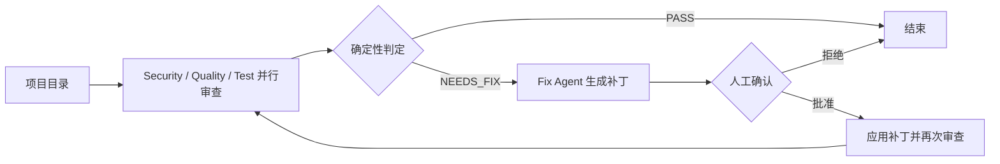

# 多智能体代码审查与修复

基于 MCP、A2A 和 LangGraph，实现安全扫描、代码质量检查、测试执行、补丁生成、人工审批与修复验证。

[详细运行说明](multi_agent_code_reviewer/README.md)

## 代码审查流程



实际实现包含重试上限。三个审查 Agent 通过 MCP 调用检查工具，Fix Agent 读取相关源文件并生成补丁。命令行交互流程在人工批准后应用补丁；评估脚本仅在临时案例副本中自动批准。

## 历史评估与本次验证

2026-08-24 历史评估结果：Precision 100%，Recall 100%，修复成功率 81.82%，安全检查 PASS。上述指标仅适用于该评估集与运行配置，不代表任意真实仓库上的性能。

- [评估方法与失败案例](multi_agent_code_reviewer/evaluation/BENCHMARK.md)
- [脱敏后的历史原始报告](multi_agent_code_reviewer/evaluation/baseline/evaluation-20260824T234040Z.json)
- 本次整理通过代码审查项目的 7 项单元测试和所有 Python 文件的语法检查；未重新运行在线模型调用、完整 A2A/MCP 服务联调或端到端评估。

## 运行与配置

进入 `multi_agent_code_reviewer` 目录，使用 Python 3.11 创建独立环境，并通过 `python -m pip install -r requirements.txt` 安装依赖。

API 密钥只通过环境变量设置，当前上传源码不含真实密钥：

```powershell
$env:DEEPSEEK_API_KEY = "your-api-key"
```

代码审查项目还需要 Git、Node.js/npx、Ollama 及对应模型；详细启动方式见子项目说明。

上传内容不含聊天记录、个人交接笔记、虚拟环境、缓存或重复压缩包。安全扫描案例中的示例密码和故意保留的漏洞用于验证检测能力，不是生产凭据。
