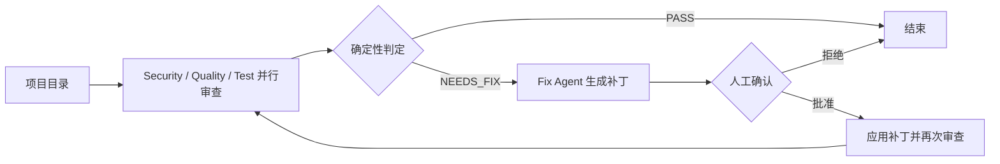

# MCP + A2A 多智能体项目合集

包含多智能体代码审查、旅行助手和协议联调示例。MCP 用于智能体调用工具，A2A 用于智能体之间的远程协作；代码审查项目使用 LangGraph 管理审查、人工确认、补丁应用和再次验证流程。

| 子项目 | 内容与状态 |
| --- | --- |
| [多智能体代码审查](multi_agent_code_reviewer/README.md) | Security / Quality / Test / Fix 四个独立 A2A 服务，连接 Semgrep、Ruff、Pytest 和 Filesystem MCP；包含人工审批和有界重试 |
| [SmartVoyage v2](smart_voyage_v2/README.md) | 天气、车票、景点、订单四个专业 Agent，A2A 协作与 HTTP MCP 工具，命令行总控 |
| [A2A + MCP 基础示例](a2a_mcp_demo/README.md) | 天气与模拟知识库两个 Agent，通过 stdio MCP 调用工具 |
| [SmartVoyage A2A 早期原型](smart_voyage_a2a/README.md) | 仅完成部分数据模型，多数模块为空，不是可运行应用 |

## 代码审查流程



实际实现包含重试上限。三个审查 Agent 通过 MCP 调用检查工具，Fix Agent 读取相关源文件并生成补丁。命令行交互流程在人工批准后应用补丁；评估脚本仅在临时案例副本中自动批准。

## 历史评估与本次验证

代码审查项目的 2026-08-24 历史报告包含 14 个自建案例、14 条人工标注问题：Precision 100%，Recall 100%，修复成功率 9/11（81.82%），安全检查 PASS。样本规模较小，不代表任意真实仓库上的性能。

- [评估方法与失败案例](multi_agent_code_reviewer/evaluation/BENCHMARK.md)
- [脱敏后的历史原始报告](multi_agent_code_reviewer/evaluation/baseline/evaluation-20260824T234040Z.json)
- 本次整理通过代码审查项目的 7 项单元测试和所有 Python 文件的语法检查；未重新运行在线模型调用、完整 A2A/MCP 服务联调或端到端评估。

## 运行与配置

请分别使用各子项目的 requirements.txt 创建独立环境：代码审查项目使用 MCP 1.29，另外两个示例使用 MCP 2.0，不能直接共用同一套依赖。建议使用 Python 3.11；原有依赖版本按源码保留。

API 密钥只通过环境变量设置，当前上传源码不含真实密钥：

```powershell
$env:DEEPSEEK_API_KEY = "your-api-key"
```

代码审查项目还需要 Git、Node.js/npx、Ollama 及对应模型；详细启动方式见子项目说明。旅行工具使用固定模拟数据，订单不会真实出票或支付；基础 RAG 工具也没有接入真实知识库。

上传内容不含聊天记录、个人交接笔记、虚拟环境、缓存或重复压缩包。安全扫描案例中的示例密码和故意保留的漏洞用于验证检测能力，不是生产凭据。
