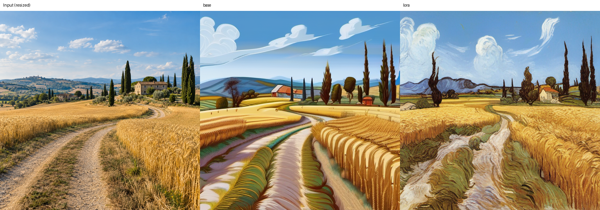
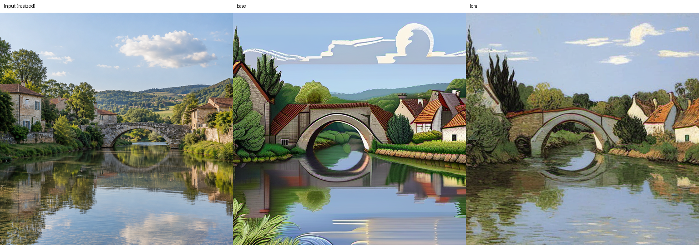
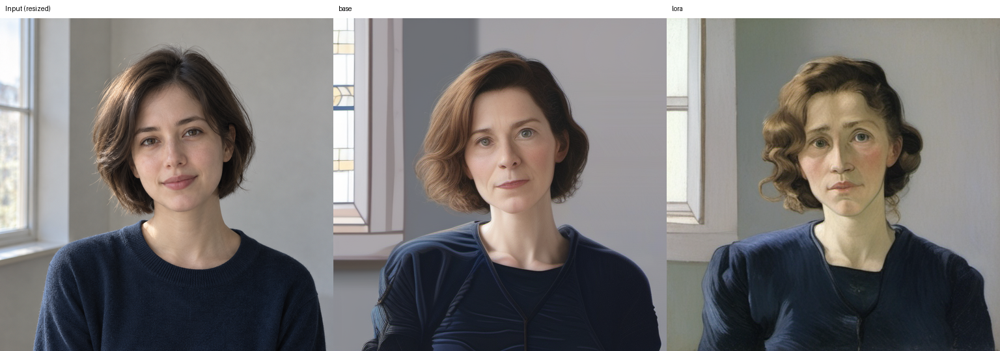
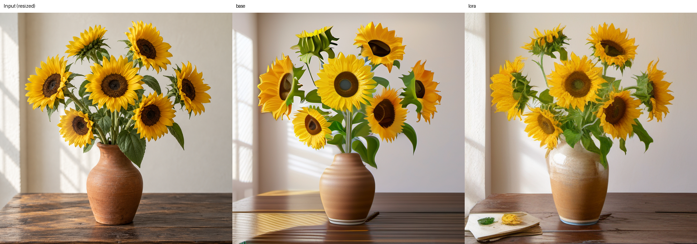
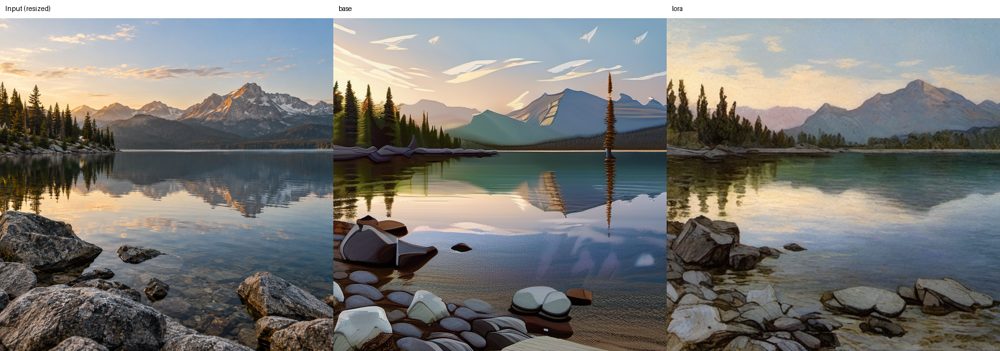

# 照片 → 梵高绘画：SDXL LoRA 第一版

本项目面向 AIGC 应用开发 / 模型微调工程学习。路线是 **绘画数据训练风格 LoRA，照片通过图生图推理转换**，不再使用 CycleGAN-Turbo 双域对抗训练。照片和绘画无需成对；照片不作为 LoRA 训练目标。

SDXL 是成熟的学习基座，不代表最新或效果最强的模型。可迁移的能力包括数据与标注、LoRA、混合精度、显存优化、断点续训、基线比较和可复现推理。掌握这些后再迁移 FLUX / Qwen-Image 等模型；不同模型的架构、许可和训练工具需另行适配。不能把此项目包装成已完成的生产系统或就业保证。

## 训练结果与效果展示

本仓库提供训练/推理源码、最终 LoRA 适配器、训练记录、开发集结果与展示图。图像按 **输入照片 / SDXL 基础模型 / 加载 LoRA** 排列，使用同一输入、提示词和种子进行组内对比。

| 项目 | 归档记录 |
| --- | --- |
| 基础模型 | SDXL Base 1.0 |
| 训练数据 | 去重后 358 张训练画作，40 张保留风格参考 |
| 配置 | UNet LoRA，rank 16，512 分辨率，2000 更新步，学习率 1e-4，BF16 |
| 有效批次 | batch 1 × 梯度累积 4 × 单 GPU = 4 |
| 训练设备与耗时 | RTX 5090，4428.19 秒（约 73.8 分钟；训练进程墙钟时间） |
| 最终适配器 | [pytorch_lora_weights.safetensors](outputs/vangogh-sdxl-v1/pytorch_lora_weights.safetensors)，约 44.5 MiB |
| 开发集 | [24 张对比与推理记录](outputs/compare-v1/)，strength 0.5，LoRA scale 0.8 |
| 展示图 | strength 0.6，LoRA scale 1.0，seed 42，30 步，guidance 5 |

### 麦田


### 石桥村庄


### 人物肖像


### 向日葵


### 山间湖泊


这些样例用于定性展示，未提供人工盲评或独立测试集质量分数。肖像面部与静物构图会发生变化，不能据此声称内容完全保留。展示集与开发集参数不同，不能跨组直接比较训练收益。

### 使用已训练权重

完成下方依赖安装后，在本项目目录运行（首次下载 SDXL 基础模型，需要 CUDA GPU）：

```bash
python scripts/infer.py --input data/lake.png --lora outputs/vangogh-sdxl-v1 --compare-base --strength 0.6 --lora-scale 1.0 --prompt "a calm mountain lake with reflections, pine trees and foreground rocks, warm evening light, a painting in the style of Vincent van Gogh" --output outputs/reproduce-lake
```

每组 `settings.json` 和 `results.jsonl` 保留原始推理参数与耗时。原始记录中的服务器绝对路径仅用于追溯；在新环境运行请使用上面的相对路径或默认 Hugging Face 模型 ID。完整训练数据需重新通过 `prepare_data.py` 生成；已附带的审计目录应先移至备份位置，脚本拒绝覆盖已有目录。

最终权重 SHA-256：`5d2b95328c1fb0c927326e402789b81367f09b780ed94278c3aee69b3250b2bb`。
只发布最终适配器，不包含基础模型和优化器检查点，因此本仓库不能直接无缝恢复原训练。

## 当前状态

- 已提供：数据审计与去重、训练/验证划分、可选自动内容标注、固定版本官方训练器、训练包装器、断点续训、单张/批量图生图、同种子基础模型对比、日志和实验参数。
- 已归档 RTX 5090 上的正式训练记录（退出码 0、2000 步配置、耗时约 73.8 分钟）、最终 LoRA 权重和 24 张开发集对比结果；本次整理仅运行 CPU 检查，未重新进行 GPU 训练。
- `vendor/train_text_to_image_lora_sdxl.py` 来自 Diffusers v0.35.1，保留原始 Apache-2.0 许可。来源与哈希见 `vendor/UPSTREAM.json`。

## 数据事实与使用方式

原始数据包：`vangogh2photo.zip`，需自行准备；仓库保留数据审计、划分清单与训练标注，不包含完整原始数据集。

原始计数：trainA 400，trainB 6287，testA 400，testB 751；全部 256×256。按解码 RGB 像素去重后，trainA 和 testA 各只有 398 张唯一图片，且两者集合完全相同；trainB 有 6278 张唯一照片，testB 有 750 张。完整审计见 `reports/data_audit.json`。

- `train`：从 trainA 的 398 张唯一图片中扣除 40 张风格验证图，剩余 358 张用于训练。
- `val_style`：40 张独立风格参考，不作为照片的配对标签。
- `eval_photos`：从 trainB 确定性选取 24 张开发集照片，排除与 testB 的重复。
- `test_photos`：testB 去重后的照片；参数选好后再跑最终测试。
- `test_style_independent`：本次为空，原 testA 没有独立于 trainA 的图片。
- 当前检测精确解码重复；近似重复和训练集内容偏差仍需人工检查。不得声称整个原 testA 是独立测试集。

512 训练会放大 256 图片，不能创造真实高频笔触。第一版用它练流程；追求高清风格效果时需换合规的高清原图。SDXL 已经可能知道梵高风格，因此必须与未加载 LoRA 的基础模型比较，不能把基础模型能力当作训练收益。

## 1. 租用服务器与安装

建议：5090 32GB、Ubuntu 22.04、Python 3.12、内存 32GB 起（64GB 更宽裕）、100GB 以上可用持久化空间，支持 Blackwell 的 NVIDIA 驱动。按小时先短测。

以下命令在 **Linux 服务器项目根目录** 执行。Windows 本地无需安装 GPU 依赖。

```bash
python3.12 -m venv .venv
source .venv/bin/activate
python -m pip install --upgrade pip
python -m pip install torch==2.8.0 torchvision==0.23.0 --index-url https://download.pytorch.org/whl/cu128
python -m pip install -r requirements.txt
python scripts/preflight.py
```

归档的 preflight 记录使用 PyTorch 2.8.0+cu128、torchvision 0.23.0 和 RTX 5090，并通过 BF16 注意力反向检查。更换环境后需重新运行 preflight 和短训练。使用原生 SDPA，不安装 xformers 或 bitsandbytes。preflight 实际运行 BF16 注意力反向传播，并检查核心包是否能共同导入。cu128 指 PyTorch 构建；宿主驱动需支持它，不能仅依据 nvidia-smi 的 CUDA 字样判断环境已正确。

首次训练/标注会下载模型，需要访问 Hugging Face。模型和代码不自动上传，训练日志默认只写本地 TensorBoard。不要把访问令牌写进脚本。

## 2. 整理数据

上传原始压缩包到服务器，例如 `/workspace/vangogh2photo.zip`，执行：

```bash
python scripts/prepare_data.py --zip /workspace/vangogh2photo.zip
python scripts/verify_dataset.py
```

脚本不解压到原始路径，按内容哈希重新命名并写入 `data/prepared`，已存在的输出目录会拒绝覆盖。写出 audit.json 和完整来源 manifest.json。无需上传本地已整理的数据，可直接在服务器重新生成相同划分。

初始 metadata.jsonl 使用统一风格提示词，可以先跑烟雾测试。质量实验建议补充画面内容，避免风格和题材纠缠：

```bash
python scripts/caption.py
# 人工检查 data/prepared/train/captions_blip.jsonl 的内容与对应画作后：
cp data/prepared/train/metadata.jsonl data/prepared/style_only_backup.jsonl
cp data/prepared/train/captions_blip.jsonl data/prepared/train/metadata.jsonl
```

BLIP 是便宜的初始内容标注工具，会误识别画作，不是可信标签来源。检查主体、数量、场景，删除瞎编内容；保留结尾风格描述。同一轮训练/续训不要修改 metadata.jsonl，改标注后开启新实验。

## 3. 训练前短测

```bash
python scripts/train.py --smoke --dry-run
python scripts/train.py --smoke
python scripts/infer.py --input data/prepared/eval_photos --limit 1 --lora outputs/smoke --compare-base --output outputs/smoke-check
```

短测仅 20 个优化更新步；梯度累积为 4，每个更新步包含 4 个微批次。目的：验证前向、反向、保存、重载和完整推理。20 步不能判断风格训练成功。最终权重为 `pytorch_lora_weights.safetensors`。

验证恢复训练：

```bash
python scripts/train.py --smoke --resume latest --max-steps 30
```

恢复要求输出目录中存在完整 checkpoint，包括优化器状态。仅有最终 LoRA 权重不能无缝恢复训练。官方脚本会按 output_dir 下的 checkpoint 名称恢复，不用于跨实验续训。

此官方版本恢复权重、优化器和步数，但没有精确跳过 epoch 内已读取批次；中途恢复可能再次看到本轮部分图片，不承诺与未中断运行逐位一致。

## 4. 第一轮正式训练

```bash
python scripts/train.py
# 如训练中断：
python scripts/train.py --resume latest
# 查看本地训练曲线（服务器可通过 SSH 转发 6006 端口）：
tensorboard --logdir outputs --host 127.0.0.1 --port 6006
```

默认 512、batch=1、累积=4、rank=16、学习率 1e-4、BF16、梯度检查点，仅训练 UNet LoRA、不训练文本编码器。2000 步是试验起点，不是最优参数。每 250 步保存，保留最近 3 个 checkpoint；如要长期比较某个早期 checkpoint，另行复制保存。

记录内容：基础模型 revision、实际命令、配置、训练脚本哈希、当轮 captions、pip freeze、完整控制台日志和墙钟时间。暂未实现训练 GPU 峰值自动采集；短测时另开终端运行 `nvidia-smi -l 1` 观察，并检查 GPU 利用率。估算费用时计入下载、验证和调试耗时。

## 5. 固定开发集对比

```bash
python scripts/infer.py --input data/prepared/eval_photos --lora outputs/vangogh-sdxl-v1 --compare-base --output outputs/compare-v1
```

输出每张照片的「输入 / 基础模型 / LoRA」拼图、独立 PNG、seed、完整推理设置、每张耗时与 PyTorch 分配峰值显存（不等于 nvidia-smi 的全部显存占用）。基础模型与 LoRA 使用相同提示词、输入和 seed。默认 strength=0.5、LoRA scale=0.8、guidance=5、30 步；不改变图片宽高比，仅按 8 像素对齐。

只做基础模型基线，无需训练：

```bash
python scripts/infer.py --input data/prepared/eval_photos --output outputs/base-only
```

单张图片与参数实验：

```bash
python scripts/infer.py --input /workspace/photo.jpg --lora outputs/vangogh-sdxl-v1 --compare-base --strength 0.4 --lora-scale 0.8 --prompt "a village beside a river, a painting in the style of Vincent van Gogh" --output outputs/single-v1
```

strength 越高通常改动越大；LoRA scale 控制适配器影响强度。每次只改一个变量。先记录 0.35/0.5/0.65 的效果，检查构图、主体、风格和伪影；不保证逐像素内容保留。若图生图结构漂移无法接受，下一版增加 ControlNet 约束，而不是直接无限训练。

## 6. 验收与求职展示

验收表见 `EVALUATION.md`。配置在开发集确定后，再对 `test_photos` 做最终评估。不要用少量无配对样本的 PSNR/SSIM 冒充转换质量；风格参考也不是照片对应真值。

面试展示应包含：数据泄漏发现与处理、基础模型对比、rank/strength 的小规模受控实验、训练成本、失败案例和部署接口设计。第一版交付训练和批处理 CLI；HTTP 服务、ComfyUI 导入工作流和 ControlNet 计划在质量确认后做，不是本版已实现功能。

## 本地 CPU 检查

```bash
python -m pip install Pillow==11.3.0
python -m unittest discover -s tests -v
python -m compileall -q scripts vendor tests
```

## 参考

- [Diffusers 官方 SDXL LoRA 训练器（固定 v0.35.1）](https://github.com/huggingface/diffusers/blob/v0.35.1/examples/text_to_image/train_text_to_image_lora_sdxl.py)
- [Diffusers 图生图与 strength](https://huggingface.co/docs/diffusers/v0.35.1/en/using-diffusers/img2img)
- [ComfyUI LoRA 工作流](https://docs.comfy.org/tutorials/basic/lora)
- [ComfyUI ControlNet 工作流](https://docs.comfy.org/tutorials/controlnet/controlnet)
- [SDXL 模型说明及许可证](https://huggingface.co/stabilityai/stable-diffusion-xl-base-1.0)

模型许可、数据来源与图片权利需随实际商用场景确认；本仓库没有替数据集或基础模型重新授权。
